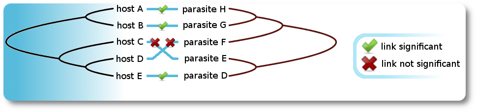

<a name="readme-top"></a> 

<h3 align="center"> Copycat </h3>
<p align="center"> The <ins>Cop</ins>h<ins>y</ins>logeneti<ins>c</ins> <ins>A</ins>nalysis <ins>T</ins>ool <br />
</p>

<!-- ABOUT THE PROJECT -->
# About

[](https://www.cophylogenetics.com/)

CopyCat provides an easy and fast access to cophylogenetic analyses. It incorporates a wrapper for the program AxParaFit, which conducts a statistical test for the presence of congruence between host and parasite phylogenies.

CopyCat offers various features, such as the creation of customized host-parasite association data and the computation of phylogenetic host/parasite trees based on the NCBI taxonomy.

The Copycat homepage (with an FAQ, classic standalone versions and a manual) is found here: https://www.cophylogenetics.com/

**Update in 2022:** 

This project is a dockerized version of Copycat, to (hopefully) solve an increasing number of compatibility issues.

Testing was only done on a Linux host machine, i.e., compatibility on Mac or Windows host systems might need further adjustments or might not work at all. Please feel free to provide feedback.

<p align="right">(<a href="#readme-top">back to top</a>)</p>

# Built With


<p align="right">(<a href="#readme-top">back to top</a>)</p>

<!-- GETTING STARTED -->

# Getting Started

## Prerequisites

> **_Disclaimer:_**  For now, I have only tested the dockerized version of Copycat on a Linux host system. I will update this section once I got hold of a Windows or Mac test system. (You are welcome to test it on such systems and to give feedback, of course. Thanks for that.)

<a href="https://docs.docker.com/engine/install/">Install docker</a> on your Linux system and make sure that your user is <a href="https://docs.docker.com/engine/install/linux-postinstall/">properly configured</a> for use with Docker:

For example, the command ...
```bash
docker -v
```
... should produce a text similar to this (except the version numbers of course):
```text
Docker version 20.10.12, build 20.10.12-0ubuntu2~20.04.1
```

Also, the command ...

```bash
docker run hello-world
```

... should produce a text containing the lines:

```text
[...]
Hello from Docker!
This message shows that your installation appears to be working correctly.
[...]
```

## Installation

1.  Clone the Copycat repository:

    ```bash
    git clone https://github.com/jmeierk/copycat.git
    ```

2. Go to the respective folder on your disk 

3. Build the Copycat image from the Dockerfile:

    ```bash
    docker build -f Dockerfile \
                 -t copycat:204 \
                 --build-arg USER_ID=$(id -u) \
                 --build-arg GROUP_ID=$(id -g) .
    ```

4. Start Copycat in a new container:

    ```bash
    # -e: set environment variable 'DISPLAY' to display of host system
    # -v: mounts current dir to target folder "copycatapp"
    # -w: use dir "copycatapp" as working directory inside the container
    # -u: set user id and group id for use in the container
    #
    docker run -ti --rm \
    	-e DISPLAY=$DISPLAY \
    	-v /tmp/.X11-unix:/tmp/.X11-unix \
    	-v "$PWD":/copycatapp \
    	-v "$PWD"/CopycatFiles:/copycatapp/CopycatFiles \
    	-w /copycatapp \
        -u "$(id -u):$(id -g)" \
    	copycat:204
    ```

5. Optional: allow access to the X server in case the following error occurs:
    
    ```text
    Can't connect to X11 window server using ':0' as the value of the DISPLAY variable
    ```
    On your **host** system you might have to allow non-network local connections to your X server:
    
    ```text
    xhost +local:
    ```
    For security reasons, you can remove this permission after using Copycat:
    
    ```text
    xhost -local:
    ```

<p align="right">(<a href="#readme-top">back to top</a>)</p>

## Example

The work on the <a href="https://doi.org/10.1080/10635150252899734">original Parafit method</a> contains a small but real dataset between (cute) pocket gophers (hosts) and chewing lice (parasites). Using the ParaFitLink1 statistic (reported on Copycat's third tab), tested at a significance value $\alpha$ = 0.05, the authors found that 7 of the 17 host/parasite links were not significant. The input files of that example are found in the `/example` folder.

For example, when testing at a more strict $\alpha$ = 0.02 only 4 significant links are reported (see Fig. 1).

**Note:** because of the quirky user interface, changes in the "Value of Significance" field will be visually applied once the result window is rendered again (can be triggered by e.g. resizing the results window or by changing the width of an arbitrary column). By far not optimal, but it works.

![**Figure 1 -- Visualization of the AxParafit results done by Copycat when testing at $\alpha$ = 0.02.** The column 'prob1' refers to the statistic 'ParaFitLink1', whereas 'prob2' refers to the statistic 'ParaFitLink2'. Both statistics were introduced in the <a href="https://doi.org/10.1080/10635150252899734">original Parafit method</a>. Simulations <a href="https://doi.org/10.1080/10635150252899734">conducted</a> with larger numbers of hosts and parasites and more links showed that power of the 'ParaFitLink1' and 'ParaFitLink2' tests increased with increasing host and parasite sample sizes.
for given proportions of coevolutionary links. The statistics 'ParaFitLink1' and 'ParaFitLink2' both have their usefulness. 'ParaFitLink1' has greater power for correctly detecting coevolutionary links in saturated coevolutionary models that contain additional random links, whereas 'ParaFitLink2' has greater power for correctly detecting coevolutionary links in unsaturated coevolutionary models, in which only a fraction of the links are coevolutionary and the other links are random. 'ParaFitLink2' cannot be used in perfect coevolutionary situations because its denominator is then zero.
\label{fig:01}](images/Parafit_expected_significant_links_at_alpha_0.02__gopher_lice_example_dataset.png)


# Citations

For the Copycat tool please cite:
```text
Meier-Kolthoff JP, Auch AF, Huson DH, Göker M. CopyCat: cophylogenetic analysis tool. Bioinformatics. 2007;23: 898–900. doi:10.1093/bioinformatics/btm027
```

For the algorithmically advanced versions AxParafit (replaces the original `Parafit`) and
AxPcoord (replaces the original `DistPCoA`) please cite:
```text
Stamatakis A, Auch AF, Meier-Kolthoff JP, Göker M. AxPcoords & parallel AxParafit: statistical co-phylogenetic analyses on thousands of taxa. BMC Bioinformatics. 2007;10: 1–10. doi:10.1186/1471-2105-8-405
```

<p align="right">(<a href="#readme-top">back to top</a>)</p>

<!-- LICENSE -->

# Terms of Usage

Use of the program is free for academic purposes at an academic institute. For all other uses, please <a href="https://www.cophylogenetics.com/contact/">contact the authors</a>. The authors do not have any kind of commercial interest in connection with the Copycat software.

<p align="right">(<a href="#readme-top">back to top</a>)</p>

<!-- CONTACT -->

# Contact

* If the feedback concerns this project, please open an <a href="https://github.com/jmeierk/copycat/issues">issue</a> because others will likely benefit from this.
* If you have general questions about Copycat, please contact me <a href="https://www.cophylogenetics.com/contact/">here</a>.

<p align="right">(<a href="#readme-top">back to top</a>)</p>
